[TOC]
# 基于主题的文本情感分析实验报告

>| 组内成员 | 学号     | 负责任务 |
>| -------- | -------- | -------- |
>| 梁济凡   | 17341091 | 写代码   |
>| 林正青   | 17341103 | 写代码   |
>| 林楠     | 17341101 | 写报告   |
>| 刘异橦   | 17341112 | 做PPT    |
>
>

## 实验题目
关于基于主题的文本情感分析。
## 实验内容

针对DataFountain的一个比赛来进行关于主题的情感分析，由于比赛已经结束，所以本实验仅基于比赛数据来进行一定的尝试和拓展。根据比赛提供的将近20000条数据来进行相关的情感分析。

实验总体步骤是先对数据进行读入->分词处理->计算词频->关键词计算（TF-IDF分析词的重要性）->计算文本相似度->K-means聚类->谱系聚类->nltk分词处理->过滤停用词->利用scipy做谱系聚类->主题建模->预测文档对应的主题->主题对应的关键词->模型可视化->情感分析

其中最为重要的实验步骤是数据读入->分词处理->计算词频->TF-IDF分析词的重要性->nltk分词处理->过滤停用词->主题建模->预测文档对应的主题->主题对应的关键词->模型可视化->情感分析

其余的一些都是拓展内容，从不同的方面尝试情感分析的一些内容。

## 实验结果

### 数据读入

利用python的pandas库来进行csv文件数据的读入

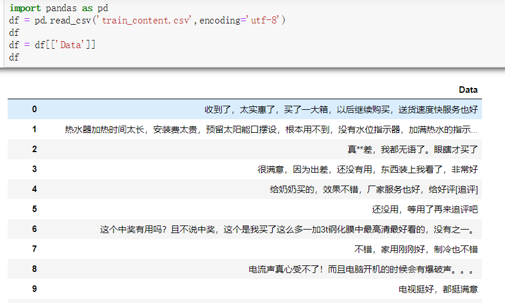

### 分词处理

现在已有的分词算法大体可以分为

- 基于字符串匹配的分词方法：这种做法需要有一个足够大的可匹配词典，这个词典中存储了很多的词条，然后计算机会与这些已经存在的词条进行匹配，匹配到一个就完成一个分词。
- 基于理解的分词方法：其做法就是让计算机尽可能模拟人类对于句子的理解，在分词的时候让计算机做到句法分析，语义分析，但是因为汉语言的庞杂以及多变性，这种分词方法并没有那么成熟。
- 基于统计的分词：这种做法是给出大量的已分好词的文本，然后利用机器学习此文本的分词方式和方法，训练相应的分词模型，从而达到对未知文本的分词，随着大量的语料库的出现以及应用，这种基于统计的分词渐渐的崭露头角。

经过一些文本分析的资料，决定使用结巴分词的方法来对自然语言进行处理。

**结巴分词**

结合基于规则和基于统计

- 基于前缀词典实现高效的词图扫描，生成句子中汉字所有可能成词情况所构成的有向无环图 (DAG)
- 采用动态规划查找最大概率路径, 找出基于词频的最大切分组合

下图是相关的处理方法

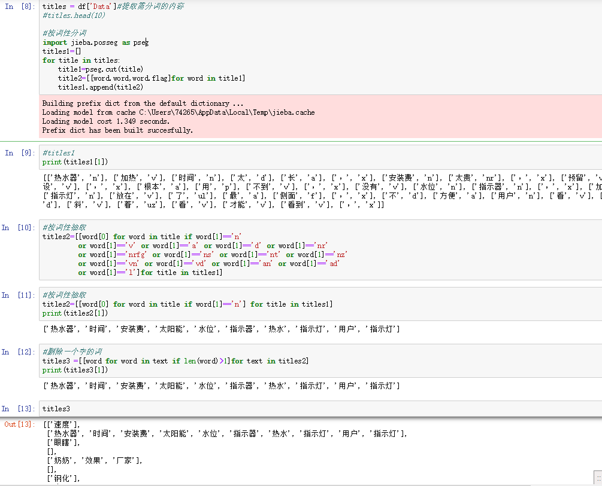

### 计算词频

最后计算词频结果为

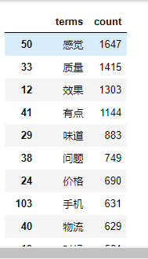

将相关的词频数据导出到了allWordsCount.csv

由上图可看出是基于一些词性来进行分类并计算词频，详情可以参考代码。

### 关键词计算

根据网上的相关资料发现关键词计算一般使用

- TF-IDF

- textrank

两种方法,这里采用TF-IDF分析法

#### **TF-IDF**是一种用于[信息检索](https://zh.wikipedia.org/wiki/%E8%B3%87%E8%A8%8A%E6%AA%A2%E7%B4%A2)与[文本挖掘](https://zh.wikipedia.org/wiki/%E6%96%87%E6%9C%AC%E6%8C%96%E6%8E%98)的常用加权技术。

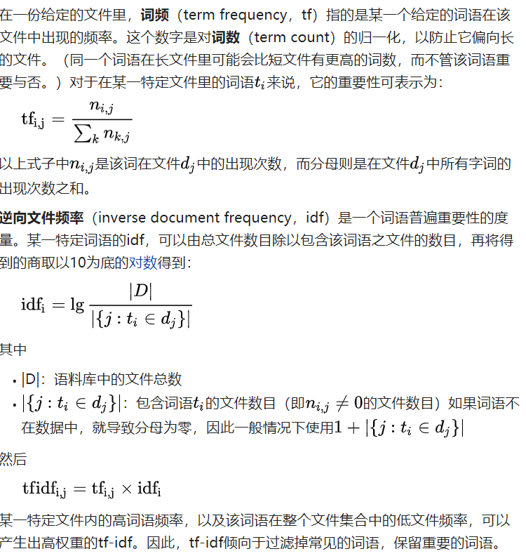

> **文本相似度**
>
> **K-means聚类**
>
> **谱系聚类**

由于文本分析中**文本相似度**与 **K-means聚类**与 **谱系聚类**也经常需要使用所以这里进行了一定的尝试和拓展

**k-means 聚类**

聚类算法有很多种，K-Means 是聚类算法中的最常用的一种，算法最大的特点是简单，好理解，运算速度快，但是只能应用于连续型的数据，并且一定要在聚类前需要手工指定要分成几类。

K-Means 聚类算法的大致意思就是“物以类聚，人以群分”。

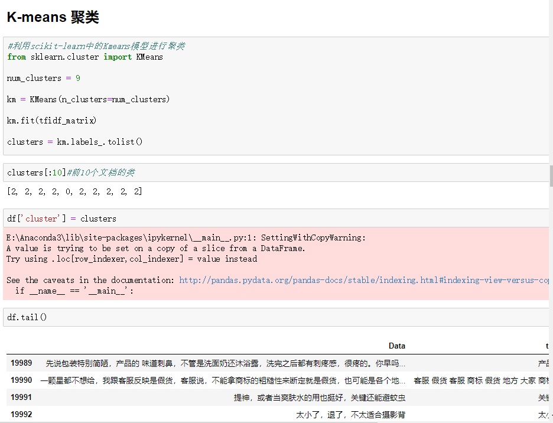

根据相关分类可以看出k-means将类似的文本进行了聚类

K-Means处理后相关输出导出到了clusters.csv文件中

文本相似度和谱系聚类不是特别重要就简单看一些结果

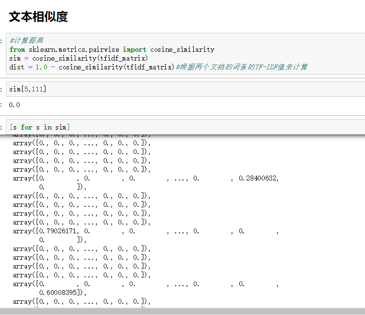

谱系聚类由于数据量过大，电脑内存不够了没有跑出来图。

### 主题建模结果

#### LDA主题模型

利用LDA主题模型,它可以将文档集中每篇文档的主题按照[概率分布](https://zh.wikipedia.org/wiki/%E6%A6%82%E7%8E%87%E5%88%86%E5%B8%83)的形式给出。同时它是一种[无监督学习](https://zh.wikipedia.org/wiki/%E9%9D%9E%E7%9B%A3%E7%9D%A3%E5%BC%8F%E5%AD%B8%E7%BF%92)算法，在训练时不需要手工标注的训练集，需要的仅仅是文档集以及指定主题的数量k即可。此外LDA的另一个优点则是，对于每一个主题均可找出一些词语来描述它。

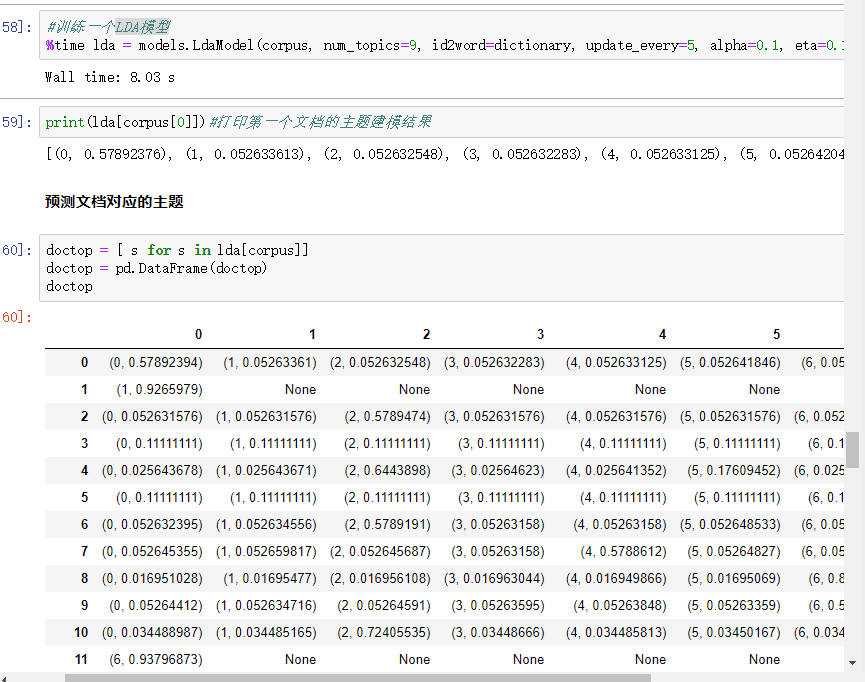可以看到相关的一些预测数据

LDA模型的预测数据导出到了DocumentTopic.csv文件里。

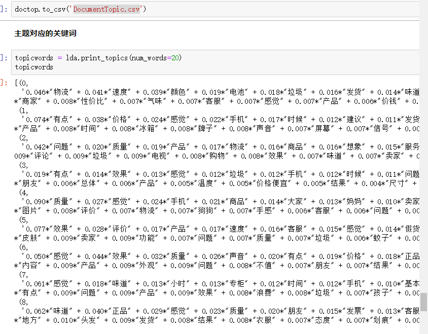

主题对应的一些关键词表示。

#### 主题建模的可视化

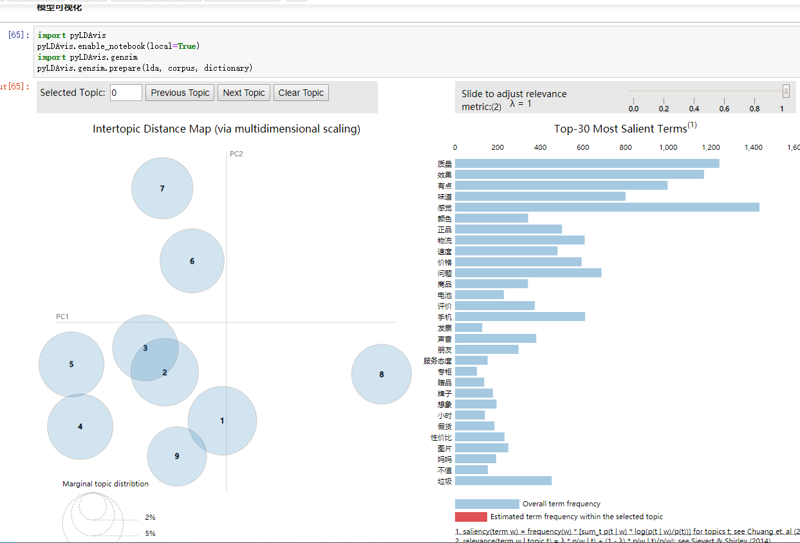

由图可知，图中共有9个气泡，分散在四个象限中，且重叠区域较少。一个好的主题模型将在整个图表中分散相当大
的非重叠气泡，而不是聚集在一个象限中，因此本次主题建模模型良好。

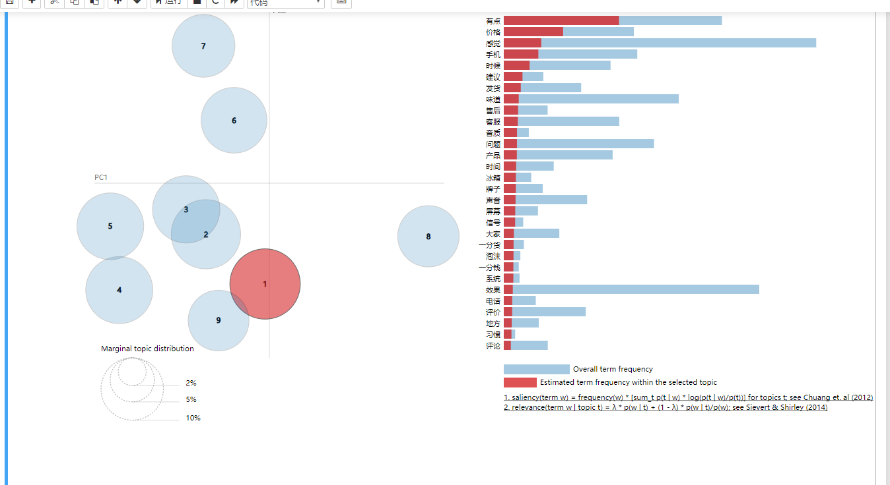

1号主题气泡最大，说明该主题在样本数据中最普遍。将光标移到改气泡上，可以看到该主题的显著关键词为“有点”、“价格”、“感觉”、“手机”、“时候”，其中“有点”的占比最大，其余四个词汇占比递减。因此，该主题可能为“有点”主题。

### 情感分析结果

### 中文情感分析
虽然中文情感分析的准确率只有70%，但是本次的情感分析结果还有有一定的参考价值的。
在情感倾向分析中，数值为[0,1]，其中 0.5 是绝对中性，0是消极，1是积极。由下图可以看出，数值大于0.5的数据
量远远大于数值小于0.5的数据量，因此，本次文本挖掘的情感倾向为正面远大于负面，即大多数内容属于正面消息

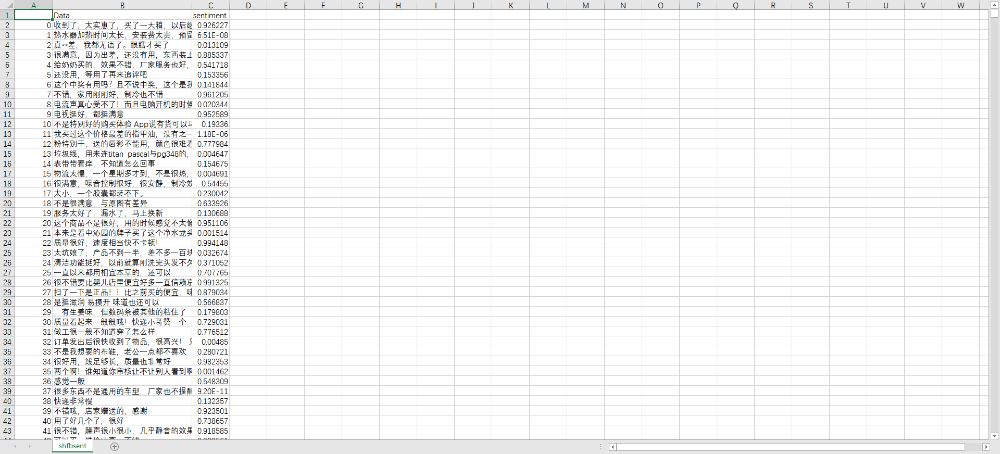

其中越接近1表示情感越偏向正面，越趋于0说明越负面

相关资料导出到了shfbsent.csv里。

根据相关的数据可以看出来最终得到的情感分析数据还是很合理的。

## 参考链接

[基于主题的文本情感分析](https://www.datafountain.cn/competitions/268/datasets?tdsourcetag=s_pctim_aiomsg)

[结巴分词](https://github.com/fxsjy/jieba)

[TF-IDF](https://zh.wikipedia.org/wiki/Tf-idf)

[K-Means聚类](https://blog.csdn.net/huangfei711/article/details/78480078)

[主题建模](https://zh.wikipedia.org/wiki/%E4%B8%BB%E9%A2%98%E6%A8%A1%E5%9E%8B)

[LDA模型](https://zh.wikipedia.org/wiki/%E4%B8%BB%E9%A2%98%E6%A8%A1%E5%9E%8B)